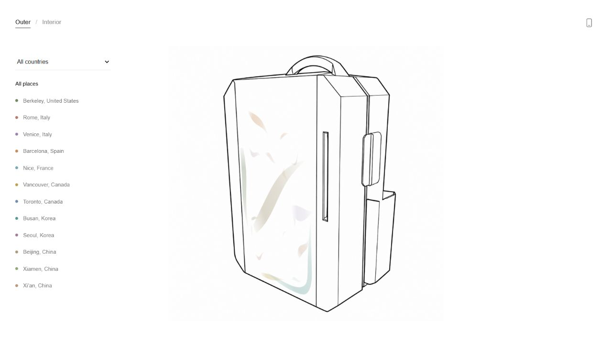

# Memento
### A backpack that remembers how it is used.

Memento explores two kinds of memory: the things we carry inside a bag, and the traces our journeys leave on its surface. This interactive prototype brings both into a quiet, image-led interface.



*The supplied backpack drawing with the approved travel-wear composition, perspective-aligned to its front panel.*

## Two ways to read the backpack

| Interior · what you carry | Outer · where you have been |
| --- | --- |
| An FSR detects changes in the backpack's load. | Colored wear marks reveal fictional travel memories. |
| Four configurations: empty, sleeves, small notebook, multiple notebooks. | 18 marks across 12 cities and seven countries. |
| The image, headline, and history respond to additions and removals. | Filter by country or city; hover, focus, or tap a mark to reveal its story. |

The exterior is a **Wizard-of-Oz storytelling prototype**: its locations and stories are authored, not GPS records or automatically detected wear. The interior uses measured pressure ranges as a proxy for staged loadouts, not object recognition.

## Try it locally

Use Node.js 22.x and npm to match the deployment environment. Desktop Chrome or Edge is needed for live USB serial input.

```sh
npm ci
npm run dev
```

Open **http://localhost:8080/?present=1** for the presentation view.

- Switch between **Outer** and **Interior** at the top left.
- Use the small **phone icon** at the top right to enter or exit the live phone preview. Your current state, filters, and history are preserved.
- Press **0**, **1**, **2**, or **3** to rehearse the interior states without hardware.
- Press **H** to reveal or hide the connection controls.
- In Outer, start with all memories, then select a country or city to isolate its marks.

The build bundles the tested p5.js version with the site, so the page has no third-party CDN dependency. No account, API key, database, or backend is required. After source edits, rebuild and refresh; there is no hot reloading.

## Connect the physical prototype

Wire the FSR and a 10 kΩ resistor as a voltage divider:

```text
5V ── FSR ──┬── A0
            │
           10 kΩ
            │
           GND
```

1. Upload [memento_pack.ino](arduino/memento_pack/memento_pack.ino) to an **Arduino Uno R4**.
2. Close Arduino Serial Monitor / Plotter.
3. Open the local page in Chrome or Edge, press **H** if setup controls are hidden, and select **connect**.
4. Choose the Arduino port. Hide setup controls and rehearse the full load-and-removal sequence.

[Hardware, thresholds, calibration, and troubleshooting →](docs/HARDWARE.md)

## The live sequence

| Configuration | Typical FSR reading | Headline |
| --- | ---: | --- |
| Empty | 0–1 | Empty state detected. Maximum volume, ready for travel. |
| Dual sleeve / pockets | 10–25 | Dual sleeve detected, ready for daily use. |
| Small notebook | 35–45 | Small notebook detected. Where you heading? |
| Large / multiple notebooks | 80–90 | Multiple notebooks detected. Seems like you’re ready to go study. |

Sequential removals show **“Large notebook removed.”**, **“Small notebook removed.”**, and **“Pockets removed.”** The history log records each change.

[Presentation runbook and rehearsal fallback →](docs/DEMO.md)

## Preserve the approved artwork

The front-panel arrangement is saved in [design/approved-front-panel-layout.json](design/approved-front-panel-layout.json). It includes positions, colors, scale, opacity, stories, and the continuous L-shaped lower-right scuff.

The supplied drawings in `public/assets/Photos/` are now used in both views. The existing overlay is perspective-aligned to the new front panel; all approved mark data and location mappings are preserved. The spiral-only interior drawing is kept as an alternate outside the four-state sequence.

[Image replacement and layout notes →](docs/ARTWORK.md)

## Repository map

```text
arduino/memento_pack/       Live FSR-to-state Arduino sketch
memento_inner_demo/         Raw A0 diagnostic sketch
public/
  index.html               Minimal two-view interface
  sketch.js                p5.js interior view and Web Serial
  outer.js                 Interactive exterior marks and filters
  mobile.js                Live phone frame and responsive resizing
  travel-data.js           Authored locations, colors, and memories
  assets/Photos/           Supplied exterior and interior PNG drawings
design/                    Approved front-panel baseline
docs/                      Demo, hardware, and artwork guides
scripts/                   Verification and production build
.github/workflows/         Automated repository checks
vercel.json                Static hosting configuration
```

## Checks and deployment

```sh
npm test
npm run build
```

Checks cover required files, browser-script syntax, travel data, and the approved front-panel baseline. The production build additionally validates runtime asset references and bundles p5.js into `dist/`. GitHub Actions tests and builds on pushes and pull requests. Browser interactions have also been checked locally; automated checks do not establish live sensor reliability.

For Vercel, import **al3xxli/memento-pack**, leave **Root Directory** at `./`, and deploy. [vercel.json](vercel.json) explicitly configures **Other**, `npm ci --include=dev`, `npm run build`, and the **dist** output directory. No environment variables are needed. The site is entirely static; no server or functions are deployed.

[Vercel import settings and production preview →](docs/DEPLOYMENT.md)

## Prototype status

The interface, supplied backpack drawings, authored travel memories, keyboard rehearsal, and serial integration are implemented. Calibrate and rehearse with the actual sensor, wiring, and physical model before each presentation.
